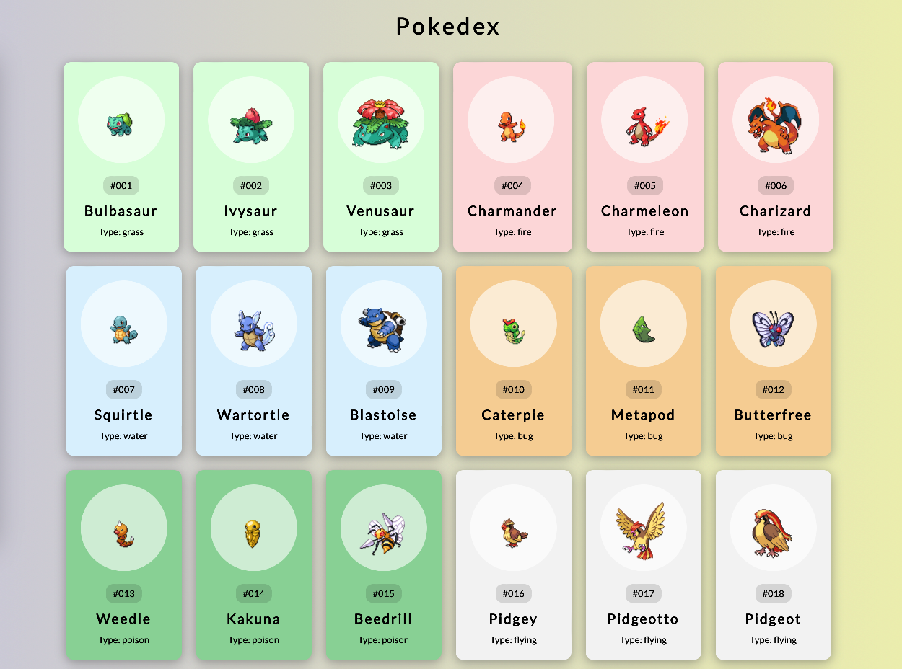

# Pokedex - a simple DOM manipulation exercise

This is Pokedex, which is basically a bunch of Pokemoon cards, with the image, id, name, type and depending on the type, the background color to be a specific color. PokeApi is the source of the data used. This is a simple DOM manipulation exercise that I did, folowing along with a tutorial.

### Links

- Solution URL: [click here](https://github.com/climaco-sarmiento/pokedex)
- Live Site URL: [click here](https://climaco-sarmiento.github.io/pokedex/)

### Screenshot

## Author

- Website - [Ubaid Khalid](https://www.ubaidkhalid.dev)
- LinkedIn - [Ubaid Khalid](https://www.linkedin.com/in/ubaid-khalid-dev/)
